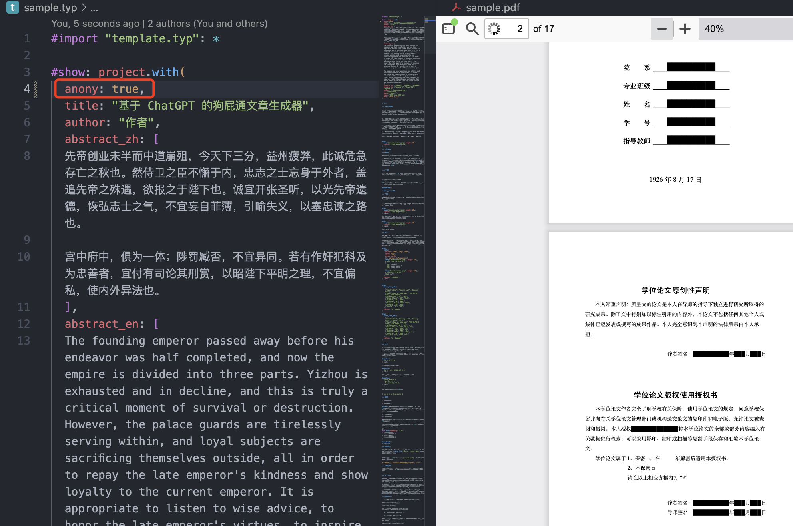

# ECUST-typst-template

用于华东理工大学毕业设计（本科）的 typst 模板，一键快速生成毕业论文 pdf，无需花费时间纠结 Word 和排版。

**快速浏览效果：[查看 sample.pdf](./sample.pdf)，样例论文源码：[查看 sample.typ](./sample.typ)**

## ⚠️ 风险警告 ⚠️

- 民间模板，存在不被认可风险
- 可能没法通过格式检查
- 暂时缺乏开题报告

## 什么是 typst

[typst](https://github.com/typst/typst) 是最新最热的标记文本语言，定位与 LaTeX 类似，具有极强的排版能力，通过一定的语法写文档，然后生成 pdf 文件。与 LaTeX 相比有以下的优势：

1. 编译巨快：因为提供增量编译的功能所以在修改后基本能在一秒内编译出 pdf 文件，typst 提供了监听修改自动编译的功能，可以像 Markdown 一样边写边看效果。
2. 环境搭建简单：原生支持中日韩等非拉丁语言，不用再大量折腾字符兼容问题以及下载好几个 G 的环境。只需要下载命令行程序就能开始编译生成 pdf。如果使用 vscode 则更简单，只需要安装 _Tinymist Typst_ 插件即可开始编写 typst 代码。
3. 语法友好：文本源码阅读性高：不会再充斥一堆反斜杠跟花括号

跟 word 比的优势：格式好调，玄学问题少。

[我的 blog 里](https://absx.pages.dev/learning/typst.html)有一些本人使用 typst 的微不足道的心得。

## 使用

1. 下载或 clone 本仓库源码。
2. 安装 vscode 并安装 _Tinymist Typst_ 插件，打开源码文件夹。
3. 按本仓库中的 `sample.typ` 照葫芦画瓢即可。保存 `.typ` 文件会自动生成 pdf。
4. 插入任务书：华东理工大学论文里需要有任务书，任务书从 _课题资料管理_ 中下载。本模板需要使用脚本插入任务书：查看 `insert_pdf.py` 并修改文件名，安装 PyPDF2 后运行即可。

## 其他特性

- 仅在 typst 0.12 - 0.13.1 版本测试过。如果此模板无法编译，请检查 typst/tinymist 版本。
- 支持匿名处理，anonymous 参数设置为 true 即为匿名，会把校名以及个人信息等替换成小黑条，论文提交阶段使用，不需要再对 pdf 作特殊编辑（致谢中的敏感信息仍需自己处理）

该模板仍需完善，有一定肉眼排版成分，所以有可能不完全符合华理排版要求，如果遇到不对的间距、字体等请提交 issue 说明，也欢迎 pull request 贡献。

## 参考及致谢

- https://github.com/werifu/HUST-typst-template：原模板
